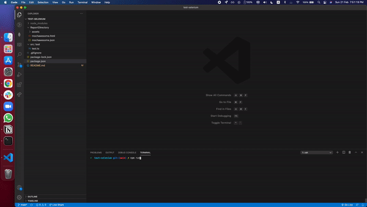

# test-selenium

Developing an e2e automation test suite through a hands-on project using Selenium.

## Links for Repos

- [Backend Repo] (https://github.com/siewla/angular-e2e-backend)
  > This repo is written in javascript with mongoDB and hosted on herokuapp.
- [Frontend Repo] (https://github.com/siewla/angular-e2e)
  > Basic Angular application with dummy data.
  > The angular app is created using angular cli and hosted on herokuapp.

## Angular App Functionalities

The app is accessible [here](https://angular-e2e.herokuapp.com/login).
Next to jump start the [backend](https://angular-e2e-backend.herokuapp.com/customers/all) first as they are hosted on herokuapp, the dynos are sleeping.

1. Register new user (agent)
2. Login to application
3. View list of all customers
4. View details of individiual customer
5. Register/Delete new customer
6. Add/Delete insurance to existing customer
7. Logout of application

## New Technologies Learned

- Angular
  > With zero experience in Angular, the learning curve for angular for me is steep. There isn't much tutorials online for latest Angular version, i have been doing trials and errors to get the functions working.
- Typescript
  > The typescript is the superset of Javascript, thus it wasn't too hard for me to understand the syntax, however, i still didn't really using the type as much as i supposed to as i just use **any** for most cases.
- Selenium Webdriver
  > There isn't much examples online of using selenium webdriver with typescript. i am following this [tutorial](https://newtechhubs.com/typescript-selenium-automation-tutorials-mocha/). The testing framework used is mocha instead of cucumber.

## Testing

- To run the test just key in
  > npm run test
- 'test' script as per below
  >     "test": "mocha -r ts-node/register  --timeout 90000 --exit  -R mochawesome --reporter-options reportDir=ReportDirectory, reportFilename=DemoReport 'src/test/*.ts'"
- Video of how automation is done.
  

- the [test](https://siewla.github.io/test-selenium/ReportDirectory/mochawesome.html) summary
